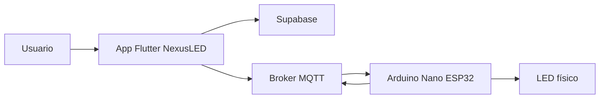

# NexusLED - Guía de exposición

## 1. Qué es NexusLED

NexusLED es una solución IoT creada para controlar un LED desde una aplicación multiplataforma hecha con Flutter y Dart. La app se comunica con un broker MQTT y, a través de ese intermediario, envía comandos al Arduino Nano ESP32 para encender o apagar el LED. El proyecto también usa Supabase para la autenticación y la sincronización de datos, de forma que la experiencia quede más completa y organizada.

## 2. Qué problema resuelve

El proyecto muestra cómo una aplicación moderna puede controlar hardware real desde distintas plataformas usando un protocolo ligero y rápido. La idea es centralizar el control del LED en una sola interfaz, sin depender de conexiones directas complicadas entre la app y el dispositivo, y con una base que se puede ampliar a más funciones después.

## 3. Por qué usamos estas tecnologías

### Flutter y Dart

Flutter se eligió porque permite desarrollar una sola aplicación para varias plataformas con una interfaz consistente. Dart es el lenguaje que usa Flutter y facilita una estructura ordenada, rápida de mantener y fácil de extender. Esto hace que el proyecto no tenga que hacerse por separado para cada sistema operativo.

### MQTT

MQTT se usa porque está pensado para IoT. Es ligero, rápido y muy útil cuando se necesita enviar mensajes pequeños entre una app y un dispositivo conectado. En lugar de conectar todo de forma directa, se usa un broker que organiza la comunicación.

### Supabase

Supabase se usa como backend porque permite manejar autenticación, almacenamiento y persistencia de información sin construir todo desde cero. Eso ayuda a que el proyecto tenga una base más profesional y fácil de escalar.

### Arduino Nano ESP32

Se usa como el dispositivo físico que recibe los mensajes y ejecuta la acción sobre el LED.

### Broker MQTT

El broker funciona como intermediario. La app publica mensajes allí y el ESP32 los recibe desde ese mismo lugar. Así, la app y el hardware no dependen de una conexión directa uno a uno.

## 4. Arquitectura general

## 5. Cómo funciona el sistema

1. El usuario abre la aplicación e inicia sesión.
2. La app carga la configuración necesaria para conectarse y deja lista la sesión.
3. Se establece la comunicación con el broker MQTT usando la información del perfil.
4. Cuando el usuario envía una orden, la app publica un mensaje en un tópico de control.
5. El ESP32 está suscrito a ese tópico y recibe el mensaje en tiempo real.
6. El ESP32 interpreta la orden y prende o apaga el LED según el comando recibido.
7. La app puede mostrar el estado actualizado del dispositivo y reflejar si la acción se ejecutó correctamente.
8. Si el sistema lo requiere, también puede mantener sincronización con la nube para conservar la información del usuario.

## 6. Conceptos clave de MQTT

### Broker

Es el servidor central que recibe y distribuye mensajes.

### Tópico

Es el canal por donde viaja un mensaje. En NexusLED se usan tópicos para control, estado y comunicación general del dispositivo, separando cada función para que el sistema sea más ordenado.

### Publicar y suscribirse

Publicar es enviar un mensaje a un tópico. Suscribirse es escuchar un tópico para recibir los mensajes que lleguen allí.

### QoS, retain y SSL/TLS

QoS define el nivel de entrega del mensaje, retain permite guardar el último valor publicado y SSL/TLS protege la comunicación cuando se necesita una conexión segura.

## 7. Cómo se genera la aplicación

NexusLED se puede compilar para Android, web y escritorio desde una sola base de código. Eso permite mantener el mismo proyecto para diferentes entornos y adaptar la salida según la plataforma que se quiera usar. En la exposición no hace falta entrar en comandos, solo explicar que Flutter permite generar varias versiones desde un mismo desarrollo.

## 8. Permisos de Android

Android necesita permisos porque la aplicación usa red y algunas funciones del sistema. Los permisos más importantes son internet, estado de red, cámara, acceso a imágenes y notificaciones, según la función que se esté usando.

## 9. Conclusiones

NexusLED integra software, nube y hardware en una solución funcional y escalable. Flutter da la base multiplataforma, MQTT permite la comunicación en tiempo real y Supabase apoya la autenticación y la persistencia. El resultado es un proyecto claro, moderno y fácil de demostrar en una exposición.

## 10. Estructura sugerida para la presentación

1. Portada.
2. Qué es NexusLED.
3. Qué problema resuelve.
4. Tecnologías usadas y por qué.
5. Arquitectura y funcionamiento general.
6. MQTT y comunicación con el ESP32.
7. Generación de Android, web y escritorio.
8. Permisos Android.
9. Conclusiones.

